# Import the packages


```python
from pandas import Series, DataFrame
import pandas as pd
import numpy as np
from matplotlib import pyplot as plt
from matplotlib import rcParams
from mpl_toolkits.basemap import Basemap
import seaborn as sns
import plotly.plotly as py
from bokeh.plotting import figure, output_file, show

```

# Read the data and change the data type of the columns


```python
zomato = pd.read_csv('C:\\Users\\cherr\\Desktop\\UT Austin\\Summer Courses\\Python\\Datasets\\zomato.csv', dtype = unicode)
country = pd.read_csv('C:\\Users\\cherr\\Desktop\\UT Austin\\Summer Courses\\Python\\Datasets\\countrycode.csv', dtype = unicode)
zomato = zomato.merge(country, left_on = 'Country Code', right_on = 'Country Code')

# Changing the data type of each column
zomato['Latitude'] = zomato['Latitude'].astype(str).astype(float)
zomato['Longitude'] = zomato['Longitude'].astype(str).astype(float)
zomato['Votes'] = zomato['Votes'].astype(str).astype(int)
zomato['Average Cost for two'] = zomato['Average Cost for two'].astype(str).astype(float)
zomato['Aggregate rating'] = zomato['Aggregate rating'].astype(str).astype(float)
zomato['Price range'] = zomato['Price range'].astype(str).astype(float)

```

# Distribution of restaurants by Country


```python
# Get the latitude and longitude values from the dataframe
lat = zomato['Latitude'].values
lon = zomato['Longitude'].values

# determine range to print based on min, max lat and lon of the data
margin = 2 # buffer to add to the range
lat_min = min(lat) - margin
lat_max = max(lat) + margin
lon_min = min(lon) - margin
lon_max = max(lon) + margin

plt.subplots(figsize = (20,20))

# create map using BASEMAP
m = Basemap(llcrnrlon=lon_min,
            llcrnrlat=lat_min,
            urcrnrlon=lon_max,
            urcrnrlat=lat_max,
            lat_0=(lat_max - lat_min)/2,
            lon_0=(lon_max-lon_min)/2,
            projection='merc'
            #resolution = 'None',
            #area_thresh=10000.,
            )
m.drawcoastlines()
m.drawcountries()
m.drawstates()
#m.drawmapboundary()
#m.fillcontinents(color='coral')
plt.title('Zomato restaurants across the world', size = 'x-large', horizontalalignment='center', weight = 'bold', color = 'grey')

# Get the mean latitude and longitude coordinates for each country and the number of restaurants there
data1 = zomato.groupby('Country')[['Latitude', 'Longitude']].mean()
data2 = zomato.groupby('Country')[['Restaurant ID']].nunique()
data = data1.merge(data2, on = 'Country')

lat1 = data['Latitude'].values
lon1 = data['Longitude'].values
count = data['Restaurant ID'].values

# convert lat and lon to map projection coordinates
lons, lats = m(lon1, lat1)

# plot points as blue dots
m.scatter(lons, lats, marker = 'o', color='b', zorder=5)

#Add label showing the number of restaurant in each country
for label, xpt, ypt in zip(count, lons, lats):
    plt.text(xpt, ypt, label, fontsize=20, color='red')
    
plt.show()


```

    C:\Users\cherr\Anaconda2\lib\site-packages\mpl_toolkits\basemap\__init__.py:3222: MatplotlibDeprecationWarning:
    
    The ishold function was deprecated in version 2.0.
    
    C:\Users\cherr\Anaconda2\lib\site-packages\mpl_toolkits\basemap\__init__.py:3231: MatplotlibDeprecationWarning:
    
    axes.hold is deprecated.
        See the API Changes document (http://matplotlib.org/api/api_changes.html)
        for more details.
    
    


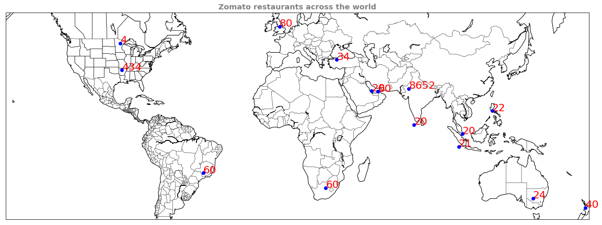


# Top 10 countries by number of restaurants


```python
# Taking top 10 countries based on the number of restaurants
y1 = zomato.groupby('Country')['Restaurant ID'].nunique().sort_values(ascending = False)[:10]

#Plot a bar chat showing these to top countries
plt.subplots(figsize = (5,5))

#Used Seaborn library to plot the bar chart
ax = sns.barplot(x=y1.index, y=y1.values, palette="deep")

#Customize the plot
ax.set(xlabel="Country", ylabel='No of Restaurants')
ax.set_xticklabels(y1.index)
ax.set_title('Top 10 Countries by restaurants', size = 'x-large', horizontalalignment='center', weight = 'bold', color = 'grey')

#Adding the text labels 
for item in ax.get_xticklabels(): item.set_rotation(90)
for i, v in enumerate(y1.iteritems()):       
    ax.text(i ,v[1], "{:,}".format(v[1]), color='black', va ='bottom', rotation=0)
    
plt.tight_layout()
plt.show()
```


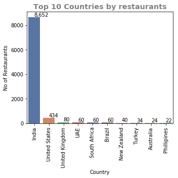


# Distribution of restaurants by Rating


```python
# Distribution of Rating
plt.subplots(figsize = (5,5))

# Plot using seaborn
ax = sns.distplot(zomato['Aggregate rating'], hist = True, kde = False, color = 'darkblue',hist_kws={'edgecolor':'black'})
ax.set_title('Distribution of rating', size = 'x-large', horizontalalignment='center', weight = 'bold', color = 'grey')
plt.show()
```


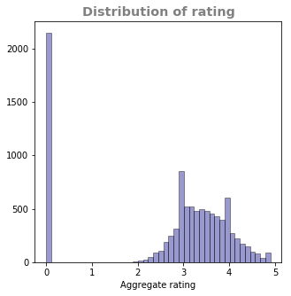


```python
#Removing all the rows with unrated restaurants
zomato_df = zomato[zomato['Aggregate rating'] != 0]
```

# Filtering for Indian restaurants


```python
#Filtering dataset for India
zomato_india = zomato_df[zomato_df['Country'] == 'India']
```

# Top 10 cities in India based on restuarants


```python
# Getting restaurants count by top 10 cities in India
y2 = zomato_india.groupby('City')['Restaurant ID'].nunique().sort_values(ascending = False)[:10]

plt.subplots(figsize = (5,5))

#Use seaborn to make a bar plot
ax = sns.barplot(x= y2.index, y= y2.values, palette="muted")

#Customize the plot
ax.set(xlabel="City", ylabel='No of Restaurants')
ax.set_xticklabels(y2.index)
ax.set_title('Restaurants by top 10 cities',size = 'x-large', horizontalalignment='center', weight = 'bold', color = 'grey')

#Adding text labels
for item in ax.get_xticklabels(): item.set_rotation(90)
for i, v in enumerate(y2.iteritems()):       
    ax.text(i ,v[1], "{:,}".format(v[1]), color='black', va ='bottom', rotation=0)
    
plt.tight_layout()
plt.show()
```


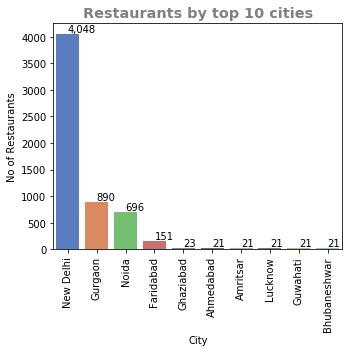


# Filtering only Delhi, Noida, Gurgaon, Ghaziabad, Faridabad restaurants


```python
top_5= zomato_india.groupby('City')['Restaurant ID'].nunique().sort_values(ascending = False)[:5]
zomato_delhi = zomato_india[zomato_india['City'].isin(top_5.index.values)]
```

# All the codes below are for the restuarnts in these top 5 cities

# Distribution by Rating


```python
#Getting restaurant count by rating type
y3= zomato_delhi.groupby('Rating text')['Restaurant ID'].nunique().sort_values(ascending = False)[:5]

#Plot the graph using seaborn
plt.subplots(figsize = (5,5))
ax = sns.barplot(x=y3.index, y=y3.values, palette="rocket")

#Customize the plot
ax.set(xlabel="Rating", ylabel='No of Restaurants')
ax.set_xticklabels(y3.index)
ax.set_title('Distribution of restaurants by rating',size = 'x-large', horizontalalignment='center', weight = 'bold', color = 'grey' )

#Adding the text labels
for item in ax.get_xticklabels(): item.set_rotation(45)
for i, v in enumerate(y3.iteritems()):       
    ax.text(i ,v[1], "{:,}".format(v[1]), color='black', va ='bottom', rotation=0)
    
plt.tight_layout()
plt.show()
```


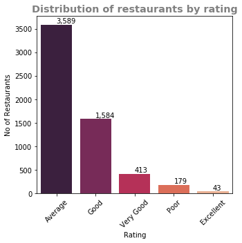


# Average number of votes by rating


```python
# Average votes for each rating
y4 = zomato_delhi.groupby('Rating text')['Votes'].mean().sort_values(ascending = False)

# Plot using seaborn
plt.subplots(figsize = (5,5))
ax = sns.barplot(x=y4.index, y=y4.values, palette="vlag")

# Customize the plot
ax.set(xlabel="Rating", ylabel='No of Votes')
ax.set_xticklabels(y4.index)
ax.set_title('Votes by Rating',size = 'x-large', horizontalalignment='center', weight = 'bold', color = 'grey')

#Adding the text labels
for item in ax.get_xticklabels(): item.set_rotation(90)
for i, v in enumerate(y4.iteritems()):       
    ax.text(i ,v[1], "{:,}".format(v[1]), color='black', va ='bottom', rotation=0)
    
plt.tight_layout()
plt.show()
```


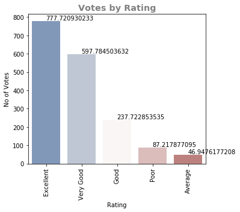


# Rating by votes


```python
# Average rating vs votes
cmap = sns.cubehelix_palette(rot=-.2, as_cmap=True)
ax = sns.scatterplot(x="Votes", y="Aggregate rating", data = zomato_delhi)

ax.set_title('Rating by votes',size = 'x-large', horizontalalignment='center', weight = 'bold', color = 'grey')
plt.show()

```


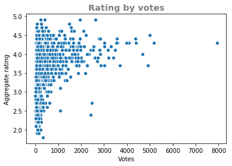


# Average cost of restaurants by rating


```python
# Using Seaborn
sns.set(style="ticks", palette="pastel")
ax = sns.boxplot(x="Rating text", y="Average Cost for two", palette="vlag",
            data=zomato_delhi)

sns.despine(offset=10, trim=True)
ax.set_title('Average Cost by Rating',size = 'x-large', horizontalalignment='center', weight = 'bold', color = 'grey')
plt.tight_layout()
```


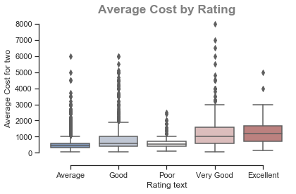


# Aggregate Rating for Online delivery & Table Booking


```python
# Aggregate rating by delivery for NCR
sns.set(style="ticks", palette="pastel")
plt.figure(figsize = (5,5))

sns.boxplot(x="Has Online delivery", y="Aggregate rating", palette = ["m", "g"],
            data=zomato_delhi)
sns.despine(offset=10, trim=True)
plt.title('Aggregate rating by Online delivery',size = 'x-large', horizontalalignment='center', weight = 'bold', color = 'grey')
```


    Text(0.5,1,'Aggregate rating by Online delivery')


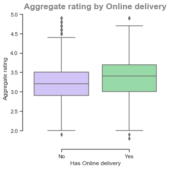


```python
# Aggregate rating by table booking for NCR
sns.set(style="ticks", palette="pastel")
plt.figure(figsize = (5,5))

sns.boxplot(x="Has Table booking", y="Aggregate rating",
            data=zomato_delhi)
sns.despine(offset=10, trim=True)
plt.title('Aggregate rating by Table booking',size = 'x-large', horizontalalignment='center', weight = 'bold', color = 'grey')
```


    Text(0.5,1,'Aggregate rating by Table booking')


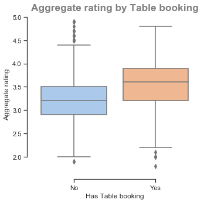


# Identifying the cuisine for the restuarant


```python
# Splitting multiple cuisines into separate rows into a new dataframe and adding multicuisine flag
zomato_delhi['Multicuisine'] = zomato_delhi['Cuisines'].str.split(',')
def splitDataFrameList(df,target_column,separator):
    ''' df = dataframe to split,
    target_column = the column containing the values to split
    separator = the symbol used to perform the split
    returns: a dataframe with each entry for the target column separated, with each element moved into a new row. 
    The values in the other columns are duplicated across the newly divided rows.
    '''
    def splitListToRows(row,row_accumulator,target_column,separator):
        split_row = row[target_column].split(separator)
        for s in split_row:
            new_row = row.to_dict()
            new_row[target_column] = s
            row_accumulator.append(new_row)
    new_rows = []
    df.apply(splitListToRows,axis=1,args = (new_rows,target_column,separator))
    new_df = pd.DataFrame(new_rows)
    return new_df
zomato_delhi_cuisines = splitDataFrameList(zomato_delhi, 'Cuisines',',')
zomato_delhi_cuisines.join(zomato_delhi_cuisines['Cuisines'].apply(lambda x: Series(x.split(','))))
zomato_delhi_cuisines['Multicuisine1'] = np.where(zomato_delhi_cuisines['Multicuisine'].str.len() > 1, 1,0)
zomato_delhi_cuisines['Cuisines'] = zomato_delhi_cuisines['Cuisines'].str.strip(to_strip = None)

```

    C:\Users\cherr\Anaconda2\lib\site-packages\ipykernel_launcher.py:2: SettingWithCopyWarning:
    
    
    A value is trying to be set on a copy of a slice from a DataFrame.
    Try using .loc[row_indexer,col_indexer] = value instead
    
    See the caveats in the documentation: http://pandas.pydata.org/pandas-docs/stable/indexing.html#indexing-view-versus-copy
    
    


```python
#Cleaning cuisines
zomato_delhi_cuisines_cleaned = zomato_delhi_cuisines[(zomato_delhi_cuisines['Cuisines']!= 'Bakery')&(zomato_delhi_cuisines['Cuisines']!= 'Cafe')&(zomato_delhi_cuisines['Cuisines']!= 'Beverages')&(zomato_delhi_cuisines['Cuisines']!= 'Mithai')&(zomato_delhi_cuisines['Cuisines']!= 'Desserts')&(zomato_delhi_cuisines['Cuisines']!= 'Ice Cream')&(zomato_delhi_cuisines['Cuisines']!= 'Fast Food')&(zomato_delhi_cuisines['Cuisines']!= 'Street Food')&(zomato_delhi_cuisines['Cuisines']!= 'Pizza')&(zomato_delhi_cuisines['Cuisines']!= 'Burger')&(zomato_delhi_cuisines['Cuisines']!= 'Healthy Food')&(zomato_delhi_cuisines['Cuisines']!='Biryani')&(zomato_delhi_cuisines['Cuisines']!='Salad')]

```

# Top 10 popular cuisines by the number of restuarants


```python
# Popular cuisines
popular_cuisines = zomato_delhi_cuisines_cleaned.groupby('Cuisines')['Restaurant ID'].nunique().sort_values(ascending = False)[:10]

#Plot using seaborn
plt.subplots(figsize = (7,7))
ax = sns.barplot(x=popular_cuisines.index, y=popular_cuisines.values, palette = 'muted')

#Customize the plot
ax.set(xlabel="Cuisine", ylabel='Restaurants')
ax.set_xticklabels(popular_cuisines.index)
ax.set_title('Top 10 cuisines',size = 'x-large', horizontalalignment='center', weight = 'bold', color = 'grey')

#Adding text labels
for item in ax.get_xticklabels(): item.set_rotation(90)
for i, v in enumerate(popular_cuisines.iteritems()):       
    ax.text(i ,v[1], "{:,}".format(v[1]), color='black', va ='bottom', rotation=45)

    plt.tight_layout()
plt.show()
```


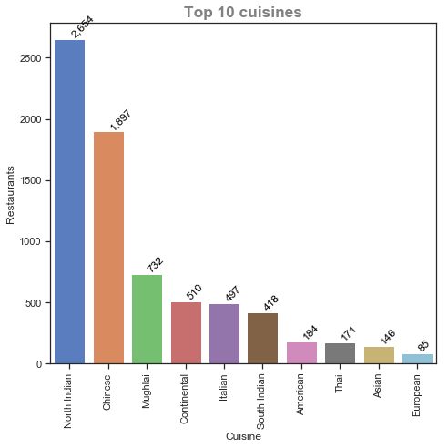


# Average cost for the popular cuisines


```python
# Average cost for two of top 10 cuisines
top_10_cuisines = zomato_delhi_cuisines_cleaned[zomato_delhi_cuisines['Cuisines'].isin(popular_cuisines.index.values)]

#Plot using seaborn
sns.set(style="ticks", palette="pastel")
plt.figure(figsize=(10,7))

#Customize the plot
ax = sns.boxplot(x="Cuisines", y="Average Cost for two", palette="vlag",
            data= top_10_cuisines)
ax.set_title('Average cost for top 10 cuisines',size = 'x-large', horizontalalignment='center', weight = 'bold', color = 'grey')

sns.despine(offset=10, trim=True)
plt.xticks(rotation = 45)
```

    C:\Users\cherr\Anaconda2\lib\site-packages\ipykernel_launcher.py:2: UserWarning:
    
    Boolean Series key will be reindexed to match DataFrame index.
    
    


    (array([0, 1, 2, 3, 4, 5, 6, 7, 8, 9]), <a list of 10 Text xticklabel objects>)


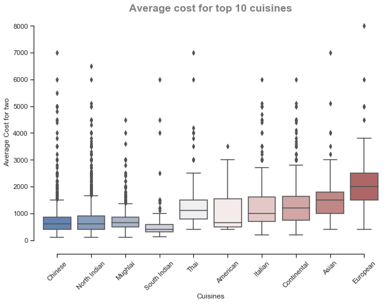


# Aggregate rating for the popular cuisines


```python
# Aggregate rating of top 10 cuisines
sns.set(style="ticks", palette="pastel")
plt.figure(figsize=(10,7))
ax = sns.boxplot(x="Cuisines", y="Aggregate rating", palette="vlag",
            data= top_10_cuisines)
ax.set_title('Aggregate rating for top 10 cuisines',size = 'x-large', horizontalalignment='center', weight = 'bold', color = 'grey')
sns.despine(offset=10, trim=True)
plt.xticks(rotation = 45)
```


    (array([0, 1, 2, 3, 4, 5, 6, 7, 8, 9]), <a list of 10 Text xticklabel objects>)


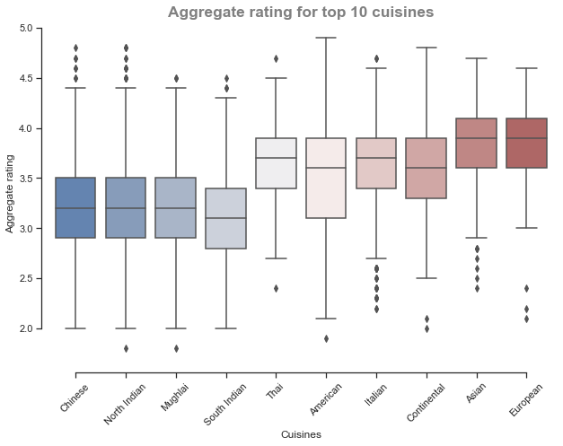


# Identifying the locality for the restuarant 

# Top 10 localities by the number of restaurants and aggregate rating


```python
#Identifying top 10 localities 
top_10_locality = top_10_cuisines.groupby(['Locality'])[['Aggregate rating', 'Average Cost for two']].agg(['mean', 'count'])

#Filtering localities where there are atleast 20 restaurants
top_10_locality = top_10_locality[top_10_locality[('Aggregate rating','count')]>=20]

#take top 20 localities with top ratings
top_10_locality = top_10_locality.sort_values(by=('Aggregate rating','mean'), ascending=False)[:10]

top_10_locality = top_10_locality.sort_values(by= 'Locality')

#Conditional formatting
cm = sns.light_palette("green", as_cmap=True)
s1 = top_10_locality.style.background_gradient(cmap=cm)
s1

```


<style  type="text/css" >
    #T_d4f70370_ae68_11e8_94ed_28c63f285b49row0_col0 {
            background-color:  #e5ffe5;
        }    #T_d4f70370_ae68_11e8_94ed_28c63f285b49row0_col1 {
            background-color:  #008000;
        }    #T_d4f70370_ae68_11e8_94ed_28c63f285b49row0_col2 {
            background-color:  #399f39;
        }    #T_d4f70370_ae68_11e8_94ed_28c63f285b49row0_col3 {
            background-color:  #008000;
        }    #T_d4f70370_ae68_11e8_94ed_28c63f285b49row1_col0 {
            background-color:  #289628;
        }    #T_d4f70370_ae68_11e8_94ed_28c63f285b49row1_col1 {
            background-color:  #ccf1cc;
        }    #T_d4f70370_ae68_11e8_94ed_28c63f285b49row1_col2 {
            background-color:  #008000;
        }    #T_d4f70370_ae68_11e8_94ed_28c63f285b49row1_col3 {
            background-color:  #ccf1cc;
        }    #T_d4f70370_ae68_11e8_94ed_28c63f285b49row2_col0 {
            background-color:  #148b14;
        }    #T_d4f70370_ae68_11e8_94ed_28c63f285b49row2_col1 {
            background-color:  #dffcdf;
        }    #T_d4f70370_ae68_11e8_94ed_28c63f285b49row2_col2 {
            background-color:  #50ac50;
        }    #T_d4f70370_ae68_11e8_94ed_28c63f285b49row2_col3 {
            background-color:  #dffcdf;
        }    #T_d4f70370_ae68_11e8_94ed_28c63f285b49row3_col0 {
            background-color:  #77c277;
        }    #T_d4f70370_ae68_11e8_94ed_28c63f285b49row3_col1 {
            background-color:  #dffcdf;
        }    #T_d4f70370_ae68_11e8_94ed_28c63f285b49row3_col2 {
            background-color:  #e5ffe5;
        }    #T_d4f70370_ae68_11e8_94ed_28c63f285b49row3_col3 {
            background-color:  #dffcdf;
        }    #T_d4f70370_ae68_11e8_94ed_28c63f285b49row4_col0 {
            background-color:  #d9f8d9;
        }    #T_d4f70370_ae68_11e8_94ed_28c63f285b49row4_col1 {
            background-color:  #e5ffe5;
        }    #T_d4f70370_ae68_11e8_94ed_28c63f285b49row4_col2 {
            background-color:  #1b8f1b;
        }    #T_d4f70370_ae68_11e8_94ed_28c63f285b49row4_col3 {
            background-color:  #e5ffe5;
        }    #T_d4f70370_ae68_11e8_94ed_28c63f285b49row5_col0 {
            background-color:  #c7eec7;
        }    #T_d4f70370_ae68_11e8_94ed_28c63f285b49row5_col1 {
            background-color:  #acdfac;
        }    #T_d4f70370_ae68_11e8_94ed_28c63f285b49row5_col2 {
            background-color:  #74c074;
        }    #T_d4f70370_ae68_11e8_94ed_28c63f285b49row5_col3 {
            background-color:  #acdfac;
        }    #T_d4f70370_ae68_11e8_94ed_28c63f285b49row6_col0 {
            background-color:  #b6e5b6;
        }    #T_d4f70370_ae68_11e8_94ed_28c63f285b49row6_col1 {
            background-color:  #c8efc8;
        }    #T_d4f70370_ae68_11e8_94ed_28c63f285b49row6_col2 {
            background-color:  #168c16;
        }    #T_d4f70370_ae68_11e8_94ed_28c63f285b49row6_col3 {
            background-color:  #c8efc8;
        }    #T_d4f70370_ae68_11e8_94ed_28c63f285b49row7_col0 {
            background-color:  #46a746;
        }    #T_d4f70370_ae68_11e8_94ed_28c63f285b49row7_col1 {
            background-color:  #b6e5b6;
        }    #T_d4f70370_ae68_11e8_94ed_28c63f285b49row7_col2 {
            background-color:  #178d17;
        }    #T_d4f70370_ae68_11e8_94ed_28c63f285b49row7_col3 {
            background-color:  #b6e5b6;
        }    #T_d4f70370_ae68_11e8_94ed_28c63f285b49row8_col0 {
            background-color:  #008000;
        }    #T_d4f70370_ae68_11e8_94ed_28c63f285b49row8_col1 {
            background-color:  #97d497;
        }    #T_d4f70370_ae68_11e8_94ed_28c63f285b49row8_col2 {
            background-color:  #55af55;
        }    #T_d4f70370_ae68_11e8_94ed_28c63f285b49row8_col3 {
            background-color:  #97d497;
        }    #T_d4f70370_ae68_11e8_94ed_28c63f285b49row9_col0 {
            background-color:  #e4fee4;
        }    #T_d4f70370_ae68_11e8_94ed_28c63f285b49row9_col1 {
            background-color:  #e1fde1;
        }    #T_d4f70370_ae68_11e8_94ed_28c63f285b49row9_col2 {
            background-color:  #d1f4d1;
        }    #T_d4f70370_ae68_11e8_94ed_28c63f285b49row9_col3 {
            background-color:  #e1fde1;
        }</style>  
<table id="T_d4f70370_ae68_11e8_94ed_28c63f285b49" > 
<thead>    <tr> 
        <th class="blank level0" ></th> 
        <th class="col_heading level0 col0" colspan=2>Aggregate rating</th> 
        <th class="col_heading level0 col2" colspan=2>Average Cost for two</th> 
    </tr>    <tr> 
        <th class="blank level1" ></th> 
        <th class="col_heading level1 col0" >mean</th> 
        <th class="col_heading level1 col1" >count</th> 
        <th class="col_heading level1 col2" >mean</th> 
        <th class="col_heading level1 col3" >count</th> 
    </tr>    <tr> 
        <th class="index_name level0" >Locality</th> 
        <th class="blank" ></th> 
        <th class="blank" ></th> 
        <th class="blank" ></th> 
        <th class="blank" ></th> 
    </tr></thead> 
<tbody>    <tr> 
        <th id="T_d4f70370_ae68_11e8_94ed_28c63f285b49level0_row0" class="row_heading level0 row0" >Connaught Place</th> 
        <td id="T_d4f70370_ae68_11e8_94ed_28c63f285b49row0_col0" class="data row0 col0" >3.74509</td> 
        <td id="T_d4f70370_ae68_11e8_94ed_28c63f285b49row0_col1" class="data row0 col1" >224</td> 
        <td id="T_d4f70370_ae68_11e8_94ed_28c63f285b49row0_col2" class="data row0 col2" >1472.1</td> 
        <td id="T_d4f70370_ae68_11e8_94ed_28c63f285b49row0_col3" class="data row0 col3" >224</td> 
    </tr>    <tr> 
        <th id="T_d4f70370_ae68_11e8_94ed_28c63f285b49level0_row1" class="row_heading level0 row1" >Cyber Hub, DLF Cyber City</th> 
        <td id="T_d4f70370_ae68_11e8_94ed_28c63f285b49row1_col0" class="data row1 col0" >3.87083</td> 
        <td id="T_d4f70370_ae68_11e8_94ed_28c63f285b49row1_col1" class="data row1 col1" >48</td> 
        <td id="T_d4f70370_ae68_11e8_94ed_28c63f285b49row1_col2" class="data row1 col2" >1704.17</td> 
        <td id="T_d4f70370_ae68_11e8_94ed_28c63f285b49row1_col3" class="data row1 col3" >48</td> 
    </tr>    <tr> 
        <th id="T_d4f70370_ae68_11e8_94ed_28c63f285b49level0_row2" class="row_heading level0 row2" >DLF Mall of India, Sector 18,  Noida</th> 
        <td id="T_d4f70370_ae68_11e8_94ed_28c63f285b49row2_col0" class="data row2 col0" >3.88437</td> 
        <td id="T_d4f70370_ae68_11e8_94ed_28c63f285b49row2_col1" class="data row2 col1" >32</td> 
        <td id="T_d4f70370_ae68_11e8_94ed_28c63f285b49row2_col2" class="data row2 col2" >1376.56</td> 
        <td id="T_d4f70370_ae68_11e8_94ed_28c63f285b49row2_col3" class="data row2 col3" >32</td> 
    </tr>    <tr> 
        <th id="T_d4f70370_ae68_11e8_94ed_28c63f285b49level0_row3" class="row_heading level0 row3" >DLF Phase 4</th> 
        <td id="T_d4f70370_ae68_11e8_94ed_28c63f285b49row3_col0" class="data row3 col0" >3.81875</td> 
        <td id="T_d4f70370_ae68_11e8_94ed_28c63f285b49row3_col1" class="data row3 col1" >32</td> 
        <td id="T_d4f70370_ae68_11e8_94ed_28c63f285b49row3_col2" class="data row3 col2" >768.75</td> 
        <td id="T_d4f70370_ae68_11e8_94ed_28c63f285b49row3_col3" class="data row3 col3" >32</td> 
    </tr>    <tr> 
        <th id="T_d4f70370_ae68_11e8_94ed_28c63f285b49level0_row4" class="row_heading level0 row4" >Epicuria Food Mall, Nehru Place</th> 
        <td id="T_d4f70370_ae68_11e8_94ed_28c63f285b49row4_col0" class="data row4 col0" >3.75385</td> 
        <td id="T_d4f70370_ae68_11e8_94ed_28c63f285b49row4_col1" class="data row4 col1" >26</td> 
        <td id="T_d4f70370_ae68_11e8_94ed_28c63f285b49row4_col2" class="data row4 col2" >1592.31</td> 
        <td id="T_d4f70370_ae68_11e8_94ed_28c63f285b49row4_col3" class="data row4 col3" >26</td> 
    </tr>    <tr> 
        <th id="T_d4f70370_ae68_11e8_94ed_28c63f285b49level0_row5" class="row_heading level0 row5" >Greater Kailash (GK) 1</th> 
        <td id="T_d4f70370_ae68_11e8_94ed_28c63f285b49row5_col0" class="data row5 col0" >3.76579</td> 
        <td id="T_d4f70370_ae68_11e8_94ed_28c63f285b49row5_col1" class="data row5 col1" >76</td> 
        <td id="T_d4f70370_ae68_11e8_94ed_28c63f285b49row5_col2" class="data row5 col2" >1231.58</td> 
        <td id="T_d4f70370_ae68_11e8_94ed_28c63f285b49row5_col3" class="data row5 col3" >76</td> 
    </tr>    <tr> 
        <th id="T_d4f70370_ae68_11e8_94ed_28c63f285b49level0_row6" class="row_heading level0 row6" >Hauz Khas Village</th> 
        <td id="T_d4f70370_ae68_11e8_94ed_28c63f285b49row6_col0" class="data row6 col0" >3.77692</td> 
        <td id="T_d4f70370_ae68_11e8_94ed_28c63f285b49row6_col1" class="data row6 col1" >52</td> 
        <td id="T_d4f70370_ae68_11e8_94ed_28c63f285b49row6_col2" class="data row6 col2" >1614.42</td> 
        <td id="T_d4f70370_ae68_11e8_94ed_28c63f285b49row6_col3" class="data row6 col3" >52</td> 
    </tr>    <tr> 
        <th id="T_d4f70370_ae68_11e8_94ed_28c63f285b49level0_row7" class="row_heading level0 row7" >Khan Market</th> 
        <td id="T_d4f70370_ae68_11e8_94ed_28c63f285b49row7_col0" class="data row7 col0" >3.85075</td> 
        <td id="T_d4f70370_ae68_11e8_94ed_28c63f285b49row7_col1" class="data row7 col1" >67</td> 
        <td id="T_d4f70370_ae68_11e8_94ed_28c63f285b49row7_col2" class="data row7 col2" >1608.21</td> 
        <td id="T_d4f70370_ae68_11e8_94ed_28c63f285b49row7_col3" class="data row7 col3" >67</td> 
    </tr>    <tr> 
        <th id="T_d4f70370_ae68_11e8_94ed_28c63f285b49level0_row8" class="row_heading level0 row8" >Sector 29</th> 
        <td id="T_d4f70370_ae68_11e8_94ed_28c63f285b49row8_col0" class="data row8 col0" >3.89787</td> 
        <td id="T_d4f70370_ae68_11e8_94ed_28c63f285b49row8_col1" class="data row8 col1" >94</td> 
        <td id="T_d4f70370_ae68_11e8_94ed_28c63f285b49row8_col2" class="data row8 col2" >1360.64</td> 
        <td id="T_d4f70370_ae68_11e8_94ed_28c63f285b49row8_col3" class="data row8 col3" >94</td> 
    </tr>    <tr> 
        <th id="T_d4f70370_ae68_11e8_94ed_28c63f285b49level0_row9" class="row_heading level0 row9" >Shahpur Jat</th> 
        <td id="T_d4f70370_ae68_11e8_94ed_28c63f285b49row9_col0" class="data row9 col0" >3.74667</td> 
        <td id="T_d4f70370_ae68_11e8_94ed_28c63f285b49row9_col1" class="data row9 col1" >30</td> 
        <td id="T_d4f70370_ae68_11e8_94ed_28c63f285b49row9_col2" class="data row9 col2" >855</td> 
        <td id="T_d4f70370_ae68_11e8_94ed_28c63f285b49row9_col3" class="data row9 col3" >30</td> 
    </tr></tbody> 
</table> 


# Aggregate rating for Italian and Continental cuisine in the top 10 localities


```python
# Aggregate rating for top 10 cuisines in top 10 localities
df1 = top_10_cuisines[top_10_cuisines['Locality'].isin(top_10_locality.index.values)]
df1 = df1[(df1['Cuisines']=='Italian') | (df1['Cuisines']=='Continental') ]
cm = sns.light_palette("orange", as_cmap=True)
pv1 = pd.pivot_table(df1, index= 'Locality', columns = 'Cuisines', values = 'Aggregate rating', aggfunc = ['mean','count'], fill_value = 0.0)
s = pv1.style.background_gradient(cmap=cm)
s
```


<style  type="text/css" >
    #T_12cfd68f_ae69_11e8_97ab_28c63f285b49row0_col0 {
            background-color:  #fff6e5;
        }    #T_12cfd68f_ae69_11e8_97ab_28c63f285b49row0_col1 {
            background-color:  #ffeac4;
        }    #T_12cfd68f_ae69_11e8_97ab_28c63f285b49row0_col2 {
            background-color:  #ffa500;
        }    #T_12cfd68f_ae69_11e8_97ab_28c63f285b49row0_col3 {
            background-color:  #ffa500;
        }    #T_12cfd68f_ae69_11e8_97ab_28c63f285b49row1_col0 {
            background-color:  #ffd587;
        }    #T_12cfd68f_ae69_11e8_97ab_28c63f285b49row1_col1 {
            background-color:  #fff6e5;
        }    #T_12cfd68f_ae69_11e8_97ab_28c63f285b49row1_col2 {
            background-color:  #ffeac3;
        }    #T_12cfd68f_ae69_11e8_97ab_28c63f285b49row1_col3 {
            background-color:  #ffe3b0;
        }    #T_12cfd68f_ae69_11e8_97ab_28c63f285b49row2_col0 {
            background-color:  #ffce74;
        }    #T_12cfd68f_ae69_11e8_97ab_28c63f285b49row2_col1 {
            background-color:  #ffc253;
        }    #T_12cfd68f_ae69_11e8_97ab_28c63f285b49row2_col2 {
            background-color:  #fff1d8;
        }    #T_12cfd68f_ae69_11e8_97ab_28c63f285b49row2_col3 {
            background-color:  #fff6e5;
        }    #T_12cfd68f_ae69_11e8_97ab_28c63f285b49row3_col0 {
            background-color:  #ffe6b9;
        }    #T_12cfd68f_ae69_11e8_97ab_28c63f285b49row3_col1 {
            background-color:  #ffc55b;
        }    #T_12cfd68f_ae69_11e8_97ab_28c63f285b49row3_col2 {
            background-color:  #ffecca;
        }    #T_12cfd68f_ae69_11e8_97ab_28c63f285b49row3_col3 {
            background-color:  #fff3de;
        }    #T_12cfd68f_ae69_11e8_97ab_28c63f285b49row4_col0 {
            background-color:  #ffa500;
        }    #T_12cfd68f_ae69_11e8_97ab_28c63f285b49row4_col1 {
            background-color:  #ffa602;
        }    #T_12cfd68f_ae69_11e8_97ab_28c63f285b49row4_col2 {
            background-color:  #fff6e5;
        }    #T_12cfd68f_ae69_11e8_97ab_28c63f285b49row4_col3 {
            background-color:  #fff3de;
        }    #T_12cfd68f_ae69_11e8_97ab_28c63f285b49row5_col0 {
            background-color:  #ffedcd;
        }    #T_12cfd68f_ae69_11e8_97ab_28c63f285b49row5_col1 {
            background-color:  #ffd281;
        }    #T_12cfd68f_ae69_11e8_97ab_28c63f285b49row5_col2 {
            background-color:  #ffd892;
        }    #T_12cfd68f_ae69_11e8_97ab_28c63f285b49row5_col3 {
            background-color:  #ffdb99;
        }    #T_12cfd68f_ae69_11e8_97ab_28c63f285b49row6_col0 {
            background-color:  #ffecca;
        }    #T_12cfd68f_ae69_11e8_97ab_28c63f285b49row6_col1 {
            background-color:  #fff4e0;
        }    #T_12cfd68f_ae69_11e8_97ab_28c63f285b49row6_col2 {
            background-color:  #ffd892;
        }    #T_12cfd68f_ae69_11e8_97ab_28c63f285b49row6_col3 {
            background-color:  #ffe0a8;
        }    #T_12cfd68f_ae69_11e8_97ab_28c63f285b49row7_col0 {
            background-color:  #ffc458;
        }    #T_12cfd68f_ae69_11e8_97ab_28c63f285b49row7_col1 {
            background-color:  #ffdb9a;
        }    #T_12cfd68f_ae69_11e8_97ab_28c63f285b49row7_col2 {
            background-color:  #ffe7bc;
        }    #T_12cfd68f_ae69_11e8_97ab_28c63f285b49row7_col3 {
            background-color:  #ffd892;
        }    #T_12cfd68f_ae69_11e8_97ab_28c63f285b49row8_col0 {
            background-color:  #ffca6a;
        }    #T_12cfd68f_ae69_11e8_97ab_28c63f285b49row8_col1 {
            background-color:  #ffa500;
        }    #T_12cfd68f_ae69_11e8_97ab_28c63f285b49row8_col2 {
            background-color:  #ffdb99;
        }    #T_12cfd68f_ae69_11e8_97ab_28c63f285b49row8_col3 {
            background-color:  #ffebc7;
        }    #T_12cfd68f_ae69_11e8_97ab_28c63f285b49row9_col0 {
            background-color:  #ffdea1;
        }    #T_12cfd68f_ae69_11e8_97ab_28c63f285b49row9_col1 {
            background-color:  #ffe5b7;
        }    #T_12cfd68f_ae69_11e8_97ab_28c63f285b49row9_col2 {
            background-color:  #ffeac3;
        }    #T_12cfd68f_ae69_11e8_97ab_28c63f285b49row9_col3 {
            background-color:  #ffebc7;
        }</style>  
<table id="T_12cfd68f_ae69_11e8_97ab_28c63f285b49" > 
<thead>    <tr> 
        <th class="blank level0" ></th> 
        <th class="col_heading level0 col0" colspan=2>mean</th> 
        <th class="col_heading level0 col2" colspan=2>count</th> 
    </tr>    <tr> 
        <th class="index_name level1" >Cuisines</th> 
        <th class="col_heading level1 col0" >Continental</th> 
        <th class="col_heading level1 col1" >Italian</th> 
        <th class="col_heading level1 col2" >Continental</th> 
        <th class="col_heading level1 col3" >Italian</th> 
    </tr>    <tr> 
        <th class="index_name level0" >Locality</th> 
        <th class="blank" ></th> 
        <th class="blank" ></th> 
        <th class="blank" ></th> 
        <th class="blank" ></th> 
    </tr></thead> 
<tbody>    <tr> 
        <th id="T_12cfd68f_ae69_11e8_97ab_28c63f285b49level0_row0" class="row_heading level0 row0" >Connaught Place</th> 
        <td id="T_12cfd68f_ae69_11e8_97ab_28c63f285b49row0_col0" class="data row0 col0" >3.70588</td> 
        <td id="T_12cfd68f_ae69_11e8_97ab_28c63f285b49row0_col1" class="data row0 col1" >3.74545</td> 
        <td id="T_12cfd68f_ae69_11e8_97ab_28c63f285b49row0_col2" class="data row0 col2" >34</td> 
        <td id="T_12cfd68f_ae69_11e8_97ab_28c63f285b49row0_col3" class="data row0 col3" >33</td> 
    </tr>    <tr> 
        <th id="T_12cfd68f_ae69_11e8_97ab_28c63f285b49level0_row1" class="row_heading level0 row1" >Cyber Hub, DLF Cyber City</th> 
        <td id="T_12cfd68f_ae69_11e8_97ab_28c63f285b49row1_col0" class="data row1 col0" >3.95</td> 
        <td id="T_12cfd68f_ae69_11e8_97ab_28c63f285b49row1_col1" class="data row1 col1" >3.68</td> 
        <td id="T_12cfd68f_ae69_11e8_97ab_28c63f285b49row1_col2" class="data row1 col2" >6</td> 
        <td id="T_12cfd68f_ae69_11e8_97ab_28c63f285b49row1_col3" class="data row1 col3" >10</td> 
    </tr>    <tr> 
        <th id="T_12cfd68f_ae69_11e8_97ab_28c63f285b49level0_row2" class="row_heading level0 row2" >DLF Mall of India, Sector 18,  Noida</th> 
        <td id="T_12cfd68f_ae69_11e8_97ab_28c63f285b49row2_col0" class="data row2 col0" >4</td> 
        <td id="T_12cfd68f_ae69_11e8_97ab_28c63f285b49row2_col1" class="data row2 col1" >3.96667</td> 
        <td id="T_12cfd68f_ae69_11e8_97ab_28c63f285b49row2_col2" class="data row2 col2" >3</td> 
        <td id="T_12cfd68f_ae69_11e8_97ab_28c63f285b49row2_col3" class="data row2 col3" >3</td> 
    </tr>    <tr> 
        <th id="T_12cfd68f_ae69_11e8_97ab_28c63f285b49level0_row3" class="row_heading level0 row3" >DLF Phase 4</th> 
        <td id="T_12cfd68f_ae69_11e8_97ab_28c63f285b49row3_col0" class="data row3 col0" >3.82</td> 
        <td id="T_12cfd68f_ae69_11e8_97ab_28c63f285b49row3_col1" class="data row3 col1" >3.95</td> 
        <td id="T_12cfd68f_ae69_11e8_97ab_28c63f285b49row3_col2" class="data row3 col2" >5</td> 
        <td id="T_12cfd68f_ae69_11e8_97ab_28c63f285b49row3_col3" class="data row3 col3" >4</td> 
    </tr>    <tr> 
        <th id="T_12cfd68f_ae69_11e8_97ab_28c63f285b49level0_row4" class="row_heading level0 row4" >Epicuria Food Mall, Nehru Place</th> 
        <td id="T_12cfd68f_ae69_11e8_97ab_28c63f285b49row4_col0" class="data row4 col0" >4.3</td> 
        <td id="T_12cfd68f_ae69_11e8_97ab_28c63f285b49row4_col1" class="data row4 col1" >4.125</td> 
        <td id="T_12cfd68f_ae69_11e8_97ab_28c63f285b49row4_col2" class="data row4 col2" >1</td> 
        <td id="T_12cfd68f_ae69_11e8_97ab_28c63f285b49row4_col3" class="data row4 col3" >4</td> 
    </tr>    <tr> 
        <th id="T_12cfd68f_ae69_11e8_97ab_28c63f285b49level0_row5" class="row_heading level0 row5" >Greater Kailash (GK) 1</th> 
        <td id="T_12cfd68f_ae69_11e8_97ab_28c63f285b49row5_col0" class="data row5 col0" >3.76923</td> 
        <td id="T_12cfd68f_ae69_11e8_97ab_28c63f285b49row5_col1" class="data row5 col1" >3.87692</td> 
        <td id="T_12cfd68f_ae69_11e8_97ab_28c63f285b49row5_col2" class="data row5 col2" >13</td> 
        <td id="T_12cfd68f_ae69_11e8_97ab_28c63f285b49row5_col3" class="data row5 col3" >13</td> 
    </tr>    <tr> 
        <th id="T_12cfd68f_ae69_11e8_97ab_28c63f285b49level0_row6" class="row_heading level0 row6" >Hauz Khas Village</th> 
        <td id="T_12cfd68f_ae69_11e8_97ab_28c63f285b49row6_col0" class="data row6 col0" >3.77692</td> 
        <td id="T_12cfd68f_ae69_11e8_97ab_28c63f285b49row6_col1" class="data row6 col1" >3.69091</td> 
        <td id="T_12cfd68f_ae69_11e8_97ab_28c63f285b49row6_col2" class="data row6 col2" >13</td> 
        <td id="T_12cfd68f_ae69_11e8_97ab_28c63f285b49row6_col3" class="data row6 col3" >11</td> 
    </tr>    <tr> 
        <th id="T_12cfd68f_ae69_11e8_97ab_28c63f285b49level0_row7" class="row_heading level0 row7" >Khan Market</th> 
        <td id="T_12cfd68f_ae69_11e8_97ab_28c63f285b49row7_col0" class="data row7 col0" >4.07143</td> 
        <td id="T_12cfd68f_ae69_11e8_97ab_28c63f285b49row7_col1" class="data row7 col1" >3.82857</td> 
        <td id="T_12cfd68f_ae69_11e8_97ab_28c63f285b49row7_col2" class="data row7 col2" >7</td> 
        <td id="T_12cfd68f_ae69_11e8_97ab_28c63f285b49row7_col3" class="data row7 col3" >14</td> 
    </tr>    <tr> 
        <th id="T_12cfd68f_ae69_11e8_97ab_28c63f285b49level0_row8" class="row_heading level0 row8" >Sector 29</th> 
        <td id="T_12cfd68f_ae69_11e8_97ab_28c63f285b49row8_col0" class="data row8 col0" >4.025</td> 
        <td id="T_12cfd68f_ae69_11e8_97ab_28c63f285b49row8_col1" class="data row8 col1" >4.12857</td> 
        <td id="T_12cfd68f_ae69_11e8_97ab_28c63f285b49row8_col2" class="data row8 col2" >12</td> 
        <td id="T_12cfd68f_ae69_11e8_97ab_28c63f285b49row8_col3" class="data row8 col3" >7</td> 
    </tr>    <tr> 
        <th id="T_12cfd68f_ae69_11e8_97ab_28c63f285b49level0_row9" class="row_heading level0 row9" >Shahpur Jat</th> 
        <td id="T_12cfd68f_ae69_11e8_97ab_28c63f285b49row9_col0" class="data row9 col0" >3.88333</td> 
        <td id="T_12cfd68f_ae69_11e8_97ab_28c63f285b49row9_col1" class="data row9 col1" >3.77143</td> 
        <td id="T_12cfd68f_ae69_11e8_97ab_28c63f285b49row9_col2" class="data row9 col2" >6</td> 
        <td id="T_12cfd68f_ae69_11e8_97ab_28c63f285b49row9_col3" class="data row9 col3" >7</td> 
    </tr></tbody> 
</table> 


# Aggregate rating for Single/Multi - cuisine restaurants


```python
# Multi Cuisine Vs Single Cuisine
sns.set(style="ticks", palette="pastel")
plt.figure(figsize=(5,5))
ax = sns.boxplot(x="Multicuisine1", y="Aggregate rating", palette="vlag",
            data= top_10_cuisines)
ax.set_title('Aggregate rating by Cuisine type',size = 'x-large', horizontalalignment='center', weight = 'bold', color = 'grey')
sns.despine(offset=10, trim=True)

```


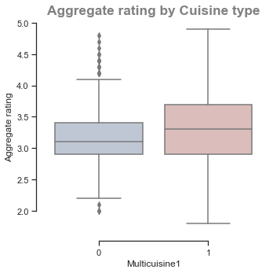


# Model Selection - Building models to predict the rating for the restaurants

# Logistic Regression


```python
# Special packages
import statsmodels.api as sm
from patsy import dmatrices

#Creating the target variable
zomato_delhi_cuisines['target'] = 0.0
zomato_delhi_cuisines['target'][zomato_delhi_cuisines['Aggregate rating'] >= 4] = 1.0
zomato_delhi_cuisines['target'].value_counts()

#Create design matrices
formula = 'target ~ 0 + Q("Average Cost for two") + Latitude + Longitude + Q("Has Online delivery") + Q("Has Table booking") +C(Multicuisine1) + Cuisines'

Y, X = dmatrices(formula, zomato_delhi_cuisines, return_type='dataframe')
y = Y['target'].values

rating_vs_target = pd.crosstab(zomato_delhi_cuisines['Aggregate rating'].astype(int), zomato_delhi_cuisines['target'])
rating_vs_target

total_ratings = rating_vs_target.apply(sum)
total_ratings

#Split the data into training and test set

from sklearn.model_selection import train_test_split
X_train, X_test, y_train, y_test = train_test_split(X, y, test_size=0.3, random_state=1)

#Fit the classifier
from sklearn.linear_model import LogisticRegression
model = LogisticRegression()
result = model.fit(X_train, y_train)

from sklearn import metrics

prediction_train = model.predict(X_train)
print 'Accuracy on training set = ',metrics.accuracy_score(y_train, prediction_train)

#Accuracy on the test set

prediction = model.predict(X_test)
print 'Accuracy on testing set = ',metrics.accuracy_score(y_test, prediction)

# y_train is 0 or 1.
print 'Number of positive examples =', len(y_train[y_train==1])
print 'Number of negative examples =', len(y_train[y_train==0])


negative_examples_in_test = len(y_test[y_test==0])
total_examples_in_test = len(y_test)

print 'Number of examples where baseline is correct =', negative_examples_in_test
print 'Baseline accuracy =', negative_examples_in_test * 1.0 / total_examples_in_test

weights = Series(model.coef_[0],
                 index=X.columns.values)
weights.sort_values()
```

    C:\Users\cherr\Anaconda2\lib\site-packages\ipykernel_launcher.py:7: SettingWithCopyWarning:
    
    
    A value is trying to be set on a copy of a slice from a DataFrame
    
    See the caveats in the documentation: http://pandas.pydata.org/pandas-docs/stable/indexing.html#indexing-view-versus-copy
    
    

    Accuracy on training set =  0.90211219623
    Accuracy on testing set =  0.901721854305
    Number of positive examples = 841
    Number of negative examples = 7965
    Number of examples where baseline is correct = 3414
    Baseline accuracy = 0.904370860927
    


    Q("Has Online delivery")[No]    -1.266935
    Cuisines[T.South Indian]        -0.967267
    Q("Has Online delivery")[Yes]   -0.947815
    Cuisines[T.Chinese]             -0.910224
    Cuisines[T.Fast Food]           -0.861894
    Cuisines[T.Mughlai]             -0.828247
    Cuisines[T.Mithai]              -0.766981
    Cuisines[T.North Indian]        -0.758343
    Cuisines[T.Street Food]         -0.720101
    Cuisines[T.Pizza]               -0.664891
    Cuisines[T.Finger Food]         -0.524482
    Cuisines[T.Burger]              -0.404338
    Cuisines[T.Raw Meats]           -0.367791
    Cuisines[T.Bakery]              -0.363582
    Cuisines[T.Japanese]            -0.319682
    Cuisines[T.Tex-Mex]             -0.237653
    Cuisines[T.Thai]                -0.236179
    Cuisines[T.Seafood]             -0.228032
    Cuisines[T.Tibetan]             -0.196406
    Cuisines[T.Salad]               -0.193942
    Cuisines[T.Bengali]             -0.120509
    Cuisines[T.Chettinad]           -0.115048
    Latitude                        -0.105096
    Cuisines[T.Biryani]             -0.100469
    Cuisines[T.Awadhi]              -0.080908
    Cuisines[T.French]              -0.073345
    Cuisines[T.Arabian]             -0.070318
    Cuisines[T.South American]      -0.069148
    Cuisines[T.Burmese]             -0.047159
    Cuisines[T.Charcoal Grill]      -0.033849
                                       ...   
    Cuisines[T.Nepalese]             0.085979
    Cuisines[T.Indian]               0.088446
    Cuisines[T.African]              0.089776
    Cuisines[T.Persian]              0.098581
    Cuisines[T.Spanish]              0.101728
    Cuisines[T.Rajasthani]           0.106808
    Cuisines[T.Continental]          0.107181
    Cuisines[T.Goan]                 0.111911
    Cuisines[T.Tea]                  0.127594
    Cuisines[T.Indonesian]           0.155761
    Cuisines[T.Vietnamese]           0.160695
    Cuisines[T.Andhra]               0.172063
    Cuisines[T.Juices]               0.174019
    Cuisines[T.Lebanese]             0.177098
    Cuisines[T.Beverages]            0.205921
    Cuisines[T.Bihari]               0.233886
    Cuisines[T.Italian]              0.235510
    Cuisines[T.Sushi]                0.237639
    Cuisines[T.Kerala]               0.243451
    Cuisines[T.Iranian]              0.291477
    Cuisines[T.American]             0.295605
    Cuisines[T.Hyderabadi]           0.306809
    Cuisines[T.Modern Indian]        0.399218
    Q("Has Table booking")[T.Yes]    0.445944
    Cuisines[T.Parsi]                0.553837
    C(Multicuisine1)[T.1]            0.581663
    Cuisines[T.European]             0.661810
    Cuisines[T.Cafe]                 0.706833
    Cuisines[T.Mexican]              0.790114
    Cuisines[T.Asian]                0.860502
    Length: 90, dtype: float64


# Decision Tree


```python
#Decision tree
from sklearn.tree import DecisionTreeClassifier
clf = DecisionTreeClassifier().fit(X_train, y_train)
print('Accuracy of Decision Tree classifier on training set: {:.2f}'
     .format(clf.score(X_train, y_train)))
print('Accuracy of Decision Tree classifier on test set: {:.2f}'
     .format(clf.score(X_test, y_test)))
```

    Accuracy of Decision Tree classifier on training set: 1.00
    Accuracy of Decision Tree classifier on test set: 0.93
    

# K-Nearest neighbors


```python
#K-nearest neighbors
from sklearn.neighbors import KNeighborsClassifier
knn = KNeighborsClassifier()
knn.fit(X_train, y_train)
print('Accuracy of K-NN classifier on training set: {:.2f}'
     .format(knn.score(X_train, y_train)))
print('Accuracy of K-NN classifier on test set: {:.2f}'
     .format(knn.score(X_test, y_test)))
```

    Accuracy of K-NN classifier on training set: 0.93
    Accuracy of K-NN classifier on test set: 0.91
    

# Linear Discriminant Regression


```python
#Linear Discriminant Analysis
from sklearn.discriminant_analysis import LinearDiscriminantAnalysis
lda = LinearDiscriminantAnalysis()
lda.fit(X_train, y_train)
print('Accuracy of LDA classifier on training set: {:.2f}'
     .format(lda.score(X_train, y_train)))
print('Accuracy of LDA classifier on test set: {:.2f}'
     .format(lda.score(X_test, y_test)))
```

    Accuracy of LDA classifier on training set: 0.89
    Accuracy of LDA classifier on test set: 0.89
    

    C:\Users\cherr\Anaconda2\lib\site-packages\sklearn\discriminant_analysis.py:388: UserWarning:
    
    Variables are collinear.
    
    

# Naive Bayes


```python
#Gaussian Naive Bayes
from sklearn.naive_bayes import GaussianNB
gnb = GaussianNB()
gnb.fit(X_train, y_train)
print('Accuracy of GNB classifier on training set: {:.2f}'
     .format(gnb.score(X_train, y_train)))
print('Accuracy of GNB classifier on test set: {:.2f}'
     .format(gnb.score(X_test, y_test)))
```

    Accuracy of GNB classifier on training set: 0.86
    Accuracy of GNB classifier on test set: 0.86
    
